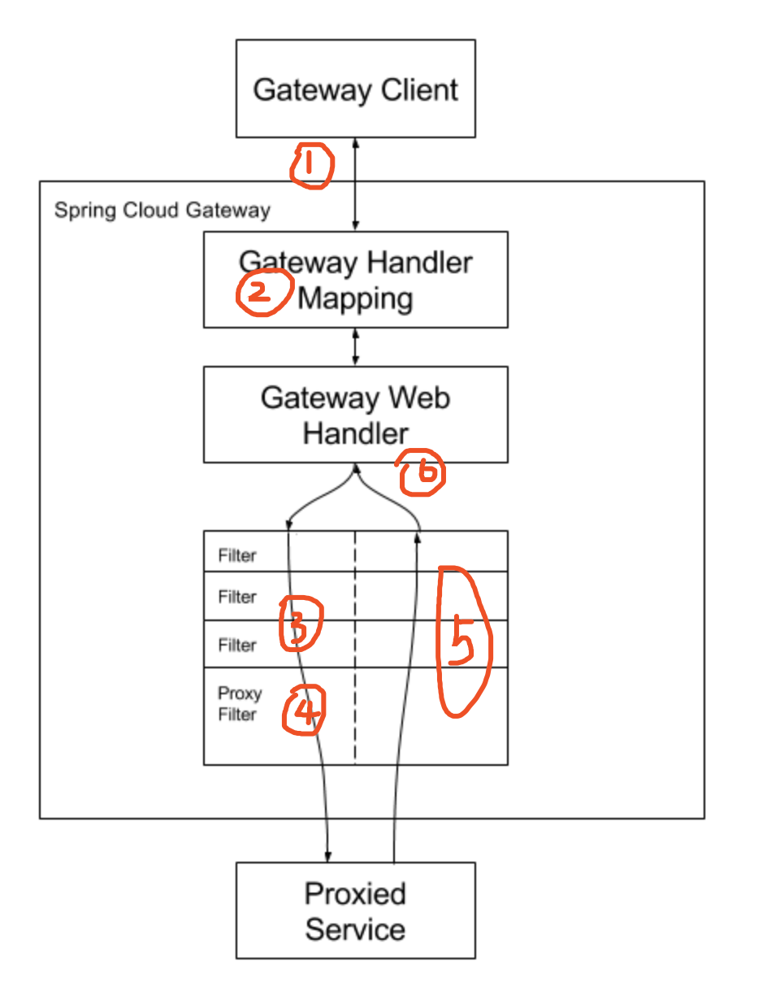

<http://www.iocoder.cn/Spring-Cloud/Spring-Cloud-Gateway/?github>
### 什么是服务网关
> 服务网关 = 路由转发 + 过滤器
- 路由转发：将请求转发到后端服务
- 过滤器：对请求进行过滤，比如鉴权、限流等

### 为什么需要服务网关
上面所说的横切功能（以权限校验为例）可以写在三个位置：
- 每个服务自己实现一边
- 写到一个公共的服务中，然后其他所有服务都依赖这个服务
> 由于每个服务引入了这个公共服务，那么相当于在每个服务中都引入了相同的权限校验的代码，使得每个服务的jar包大小无故增加了一些，尤其是对于使用docker镜像进行部署的场景，jar越小越好；
由于每个服务都引入了这个公共服务，那么我们后续升级这个服务可能就比较困难，而且公共服务的功能越多，升级就越难，而且假设我们改变了公共服务中的权限校验的方式，想让所有的服务都去使用新的权限校验方式，我们就需要将之前所有的服务都重新引包，编译部署。
- 写到服务网关的前置过滤器中，所有请求过来进行权限校验
> 将权限校验的逻辑写在网关的过滤器中，后端服务不需要关注权限校验的代码，所以服务的jar包中也不会引入权限校验的逻辑，不会增加jar包大小；
> 如果想修改权限校验的逻辑，只需要修改网关中的权限校验过滤器即可，而不需要升级所有已存在的微服务。


### 服务网关技术选型
1. 总体流程

- 服务网关、openfeign、服务提供者启动时注册到注册中心上去
- 用户请求时直接请求网关，网关做只能路由转发到open-service，这其中包括权限校验、监控、限流等操作
- open-service调用服务提供者，服务提供者返回结果给open-service，open-service返回网关，网关将结果给用户

2. 引入网关的注意点

- 增加了网关，多了一层转发（原本用户请求直接访问open-service即可），性能会下降一些（但是下降不大，通常，网关机器性能会很好，而且网关与open-service的访问通常是内网访问，速度很快）；
- 网关的单点问题：在整个网络调用过程中，一定会有一个单点，可能是网关、nginx、dns服务器等。防止网关单点，可以在网关层前边再挂一台nginx，nginx的性能极高，基本不会挂，这样之后，网关服务就可以不断的添加机器。但是这样一个请求就转发了两次，所以最好的方式是网关单点服务部署在一台牛逼的机器上（通过压测来估算机器的配置），而且nginx与zuul的性能比较，根据国外的一个哥们儿做的实验来看，其实相差不大，zuul是netflix开源的一个用来做网关的开源框架；
- 网关要尽量轻。

3. 服务网关基本功能
- 智能路由：接受外部一切请求，根据请求的url，将请求转发到后端的服务上去

- 负载均衡：将请求转发到后端服务时，可以根据负载均衡算法将请求转发到不同的服务实例上去
  - 注意：我们只转发外部请求，服务之间的请求不走网关，这就表示全链路追踪、内部服务API监控、服务降级、服务熔断等功能都不需要在网关中实现，而是在服务提供者中实现，这样可以减少网关的压力，提高网关的性能。
- 权限校验：只校验用户向open-service服务的请求，不校验服务内部的请求。
- API监控：监控用户向open-service服务的请求，不监控服务内部的请求。
- 限流：
- API日志统一收集

### Spring Cloud Gateway整体架构
> 注意：一定要好好理解Route、Predicate、Filter的关系，这是Spring Cloud Gateway的核心概念。
![])(src=)
- Gateway接受客户端请求
- 请求与Predicate匹配，获取到对应的Route。对应的匹配成功则继续往下执行
- 请求经过Filter过滤器链，执行前置处理逻辑。（例如：修改请求头信息等）
- 请求被Proxy Filter转发至目标URI，并获得最终相应。
- 响应经过Filter过滤器链，执行后置处理逻辑。
- 响应返回给客户端。


### 接口限流
#### 问题描述
某天A君突然发现自己的接口请求量突然涨到之前的10倍，没多久该接口几乎不可使用，并引发连锁反应导致整个系统崩溃。如何应对这种情况呢？生活给了我们答案：比如老式电闸都安装了保险丝，一旦有人使用超大功率的设备，保险丝就会烧断以保护各个电器不被强电流给烧坏。同理我们的接口也需要安装上“保险丝”，以防止非预期的请求对系统压力过大而引起的系统瘫痪，当流量过大时，可以采取拒绝或者引流等机制。

#### 限流算法
常用的限流算法有两种：漏桶算法和令牌桶算法。

- 漏桶算法： 漏桶算法思路很简单，水（请求）先进入到漏桶里，漏桶以一定的速度出水，当水流入速度过大会直接溢出，可以看出漏桶算法能强行限制数据的传输速率。
- 令牌桶算法： 对于很多应用场景来说，除了要求能够限制数据的平均传输速率外，还要求允许某种程度的突发传输。这时候漏桶算法可能就不合适了，令牌桶算法更为适合。如图2所示，令牌桶算法的原理是系统会以一个恒定的速度往桶里放入令牌，而如果请求需要被处理，则需要先从桶里获取一个令牌，当桶里没有令牌可取时，则拒绝服务。


#### 网关限流规则
sentinel-spring-cloud-gateway-adapter 项目增加了网关限流规则（GatewayFlowRule），针对 API Gateway 的场景定制的限流规则，可以针对不同 route 或自定义的 API 分组进行限流，支持针对请求中的参数、Header、来源 IP 等进行定制化的限流。
```json
[
  {
    "resource": "yudaoyuanma",
    "count": 3
  },
  {
    "resource": "yudaoyuanma_customized_api",
    "count": 1
  }
]

```
GatewayFlowRule 的字段解释如下：

resource：资源名称，可以是网关中的 route 名称或者用户自定义的 API 分组名称。
resourceMode：规则是针对 API Gateway 的 route 还是用户在 Sentinel 中定义的 API 分组，默认是 route。
grade：限流指标维度，同限流规则的 grade 字段。
count：限流阈值
intervalSec：统计时间窗口，单位是秒，默认是 1 秒。
controlBehavior：流量整形的控制效果，同限流规则的 controlBehavior 字段，目前支持快速失败和匀速排队两种模式，默认是快速失败。
burst：应对突发请求时额外允许的请求数目。
maxQueueingTimeoutMs：匀速排队模式下的最长排队时间，单位是毫秒，仅在匀速排队模式下生效。
paramItem：参数限流配置。若不提供，则代表不针对参数进行限流，该网关规则将会被转换成普通流控规则；否则会转换成热点规则。其中的字段：
parseStrategy：从请求中提取参数的策略，目前支持提取来源 IP、Host、任意 Header 和任意 URL 参数四种策略。
fieldName：若提取策略选择 Header 模式或 URL 参数模式，则需要指定对应的 header 名称或 URL 参数名称。
pattern：参数值的匹配模式，只有匹配该模式的请求属性值会纳入统计和流控；若为空则统计该请求属性的所有值。
matchStrategy：参数值的匹配策略，目前支持精确匹配、子串匹配和正则匹配三种策略。


#### API定义分组
sentinel-spring-cloud-gateway-adapter 项目增加了API 定义分组（ApiDefinition），用户自定义的 API 定义分组，可以看做是一些 URL 匹配的组合。比如我们可以定义一个 API 叫 my_api，请求 path 模式为 /foo/** 和 /baz/** 的都归到 my_api 这个 API 分组下面。限流的时候可以针对这个自定义的 API 分组维度进行限流。

ApiDefinition 的字段解释如下：

apiName：分组名。
predicateItems：匹配规则(ApiPathPredicateItem)数组。

```json
[
  {
    "apiName": "yudaoyuanma_customized_api",
    "predicateItems": [
      {
        "pattern": "/categories/**",
        "matchStrategy": 1
      },
      {
        "items": [
          {
            "pattern": "/Dubbo/good-collection/",
            "matchStrategy": 0
          },
          {
            "pattern": "/SkyWalking/**",
            "matchStrategy": 1
          }
        ]
      }
    ]
  }
]
```

#### 网关流控实现原理
当通过 GatewayRuleManager 加载网关流控规则（GatewayFlowRule）时，无论是否针对请求属性进行限流，Sentinel 底层都会将网关流控规则转化为热点参数规则（ParamFlowRule），存储在 GatewayRuleManager 中，与正常的热点参数规则相隔离。转换时 Sentinel 会根据请求属性配置，为网关流控规则设置参数索引（idx），并同步到生成的热点参数规则中。
)

#### GlobalFilter
在 Gateway 中，有两类过滤器：

Route Filter 路由过滤器，对应 GatewayFilter 接口
Global Filter 全局过滤器，对应 GlobalFilter 接口

两者基本是等价的，差别在于 Route Filter 不是全局，而是可以配置到指定路由上。

##### 组合 RouteFilter 和 GlobalFilter 的排序
当请求与路由匹配时，FilteringWebHandler 将所有的 GlobalFilter 和该路由的 GatewayFilter 都到 DefaultGatewayFilterChain 过滤器链中。这个合并的过滤器链的排序是基 @Ordered 注解，或者 Ordered 接口来获取排序值的
``` FilteringWebHandler.java
@Override
public Mono<Void> handle(ServerWebExchange exchange) {
	// <1> 获得路由的 GatewayFilter 数组
	Route route = exchange.getRequiredAttribute(GATEWAY_ROUTE_ATTR);
	List<GatewayFilter> gatewayFilters = route.getFilters();
	
	// <2> 获得所有的 GlobalFilter 数组。注意，在 Gateway 的内部实现，GlobalFilter 会转换成 GatewayFilter。
	List<GatewayFilter> combined = new ArrayList<>(this.globalFilters);
	combined.addAll(gatewayFilters); // 合并
	// <3> 排序
	AnnotationAwareOrderComparator.sort(combined);
	// <4> 创建过滤器链
	return new DefaultGatewayFilterChain(combined).filter(exchange);
}
```